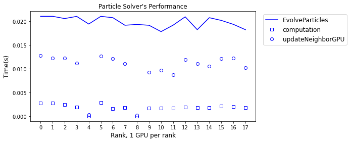
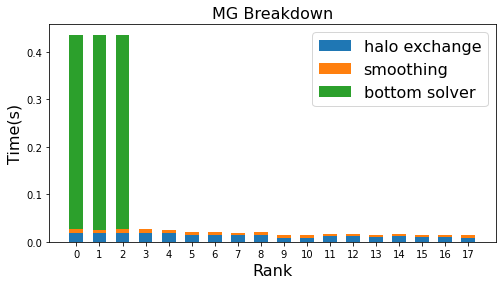

# amrex_profiling_analyzer

This toolkit aims to augment AMReX's base profiling and profVis in the following aspects:
* provide easy access to profiling results
* analyze per-process time cost along critical call paths
* find where the most expensive functions are called
* detail the high-level expensive functions including what child functions it calls and their costs

## Dependency
This toolkit is based on AMReX's base profiling. To enable base profiling, one needs to add `-DAMReX_BASE_PROFILING` and `-DAMReX_TRACE_PROFILING` while building AMReX.

The codes are written in python and depend on numpy.

## Usage
The following demonstrates some simple usages. More detailed examples can be found in `analyze.py`.

This toolkit organizes the profiling results from each rank into a tree structure via the following command
```python
roots = build_calltree_list(path='../bl_prof_bin', nProc=18)
```
`roots` is a list of tree root.

One can find the time breakdown of a profiled function. For instance, the code below
```python
callPath = ['mfix_solve', 'mfix_dem::EvolveParticles()']
print_runtime(roots, callPath, depth=1, pid=1)
```
outputs the time costs of `mfix_dem:EvolveParticles()` and its child functions (depth 1) on rank 1 as follows,
```
-------- processes 1 --------
mfix_dem::EvolveParticles()  2.10e-02  1
   ParticleContainer::SortParticlesByBin()  9.44e-04  0.0449  1
   NeighborParticleContainer::clearNeighborsGPU 4.47e-05  0.0021  4
   ParticleContainer::RedistributeGPU()     2.49e-03  0.1187  2
   NeighborParticleContainer::fillNeighbors 1.28e-02  0.6111  1
   NeighborParticleContainer::buildNeighborList 1.85e-03  0.0881  1
   particles_computation                    2.78e-03  0.1320  1
```
For each child function, the 2nd column shows the time cost.
The 3rd column denotes the percentage in its parent function's cost.
The last column presents the number of calls.

<br/>
One can plot time costs by ranks to check for load imbalance.



<br/>
One can also analyze the breakdown of a particular module's cost

